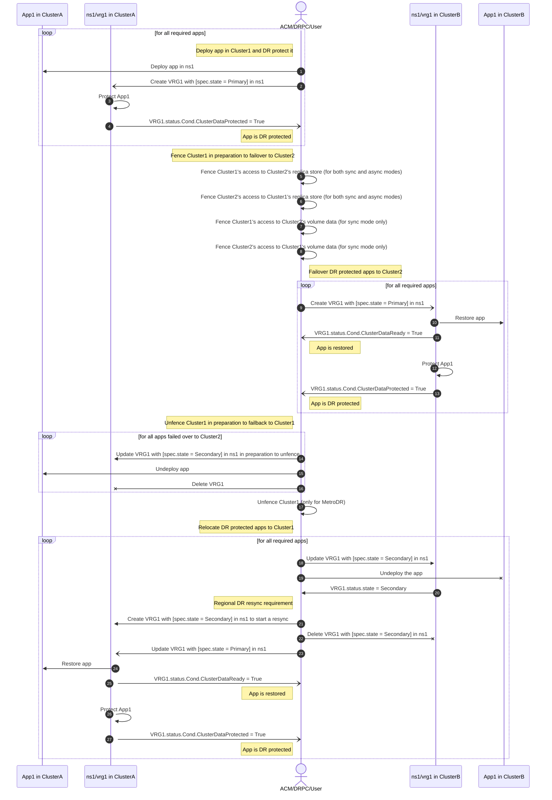

# VolumeReplicationGroup (VRG) Sequence Diagram

The sequence below shows DR protection, failover and relocate of application.  This is a VRG focussed diagram and for simplicity (to reduce clutter), this diagram views the actions performed by ACM, DRPC or user as if they are performed by a single actor or entity.

This version of the diagram only shows `ClusterData` related VRG conditions and does not show `Data` related VRG conditions.

