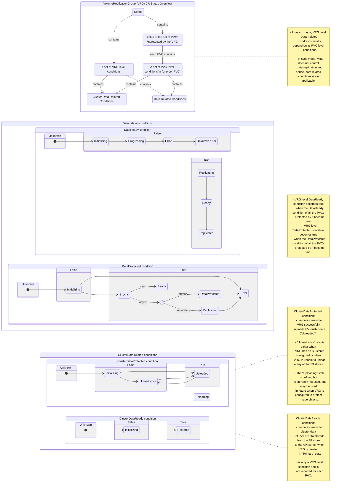

# VolumeReplicationGroup (VRG) CR Status Conditions

This page outlines the various conditions reported by the VolumeReplicationGroup (VRG) CR that is deployed on the DR cluster.

1. VRG reports `Data` related conditions and `ClusterData` related conditions.
   - `Data` refers to PVC data contents
   - `ClusterData` refers to PVC related etcd data
      - `PersistentVolume` or `PV`.
      - In future: `PersistentVolumeClaim` or `PVC`.
      - In future: Other kube objects, if VRG is enabled to protect them.
1. The conditions reported by the VRG depends upon its configuration.
    - The protection mode: `sync` or `async`.
    - PVC access mode: RWO or RWX of a `async` mode VRG.
    - TBD: Ideally, a Kubernetes CR should report all conditions, even if some conditions
    are not applicable (their state can be false, say with `Not applicable` reason).
1. A VRG in `async` mode is responsible for `Data` replication and `ClusterData` replication.
   Hence, both `Data` related conditions and `ClusterData` related conditions are applicable.
   - A VRG in async mode with PVCs in RWX mode reports VolSync related `Data` related conditions.
   These conditions are not yet shown below.
   - TBD: The complex state transition details within each `Data` related conditions on primary and
   secondary cluster needs to shown accurately in the figures below.
1. A VRG in `sync` mode is `not` responsible for `Data` replication but is responsible for
   `ClusterData` replication.  Hence, `Data` related conditions are not applicable in `sync` mode
   but `ClusterData` related conditions are applicable.
   TBD: A VRG in `sync` mode could set its `Data` related conditions to false state with `Not applicable` reason.

<!---
For the hub cluster related CR conditions, see [DRPC CR Status Conditions](drpc-status-conditions.md) and
[DRPolicy CR Status Conditions](drpolicy-status-conditions.md).
-->

<!--
    state DataProtectedCondition {
        direction LR

        state DPUnknown {
            [*] --/ DPInitializing
        }

        state DPTrue {
            state if_sync <<choice>>
            state if_primary <<choice>>

            DPInitializing --/ if_sync
            if_sync --/ DPReady : sync
            if_sync --/ if_primary : async

            if_primary --/ DPProtected
            DPReplicating --/ DPProtected
        }

        state DPFalse {
            DPInitializing --/ DPError
            DPReplicating --/ DPError
        }

    }

    state DataReadyCondition {
        direction LR

        state DRUnknown {
            [*] --/ DRInitializing
        }

        state DRFalse {
            DRInitializing --/ DRError
            DRInitializing --/ DRReplicating
            DRReplicating --/ DRReplicated
            DRReplicating --/ DRProgressing
            DRReplicating --/ DRError
            DRReplicating --/ DRUnknownError
        }
        state DRTrue {
            DRReplicating --/ DRReady
        }

    }
}

-->
